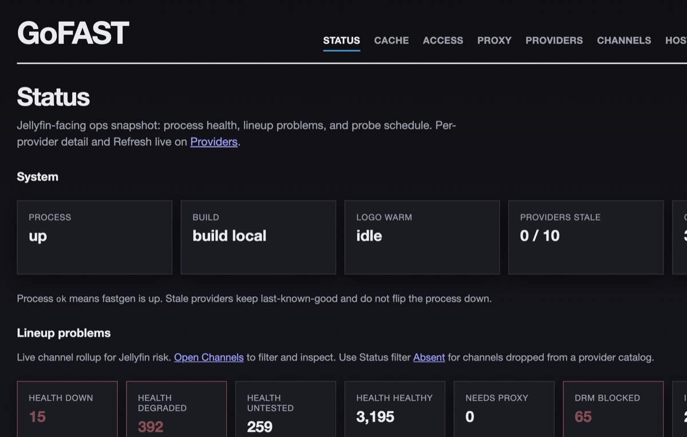
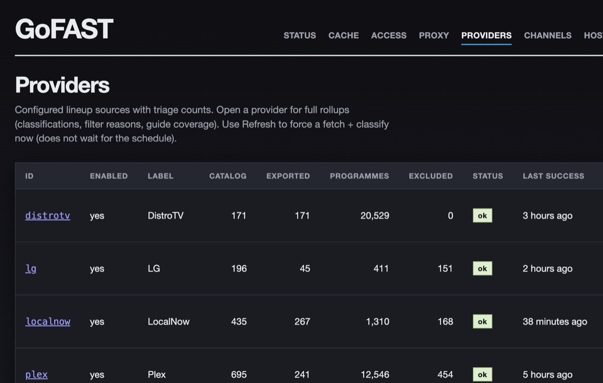
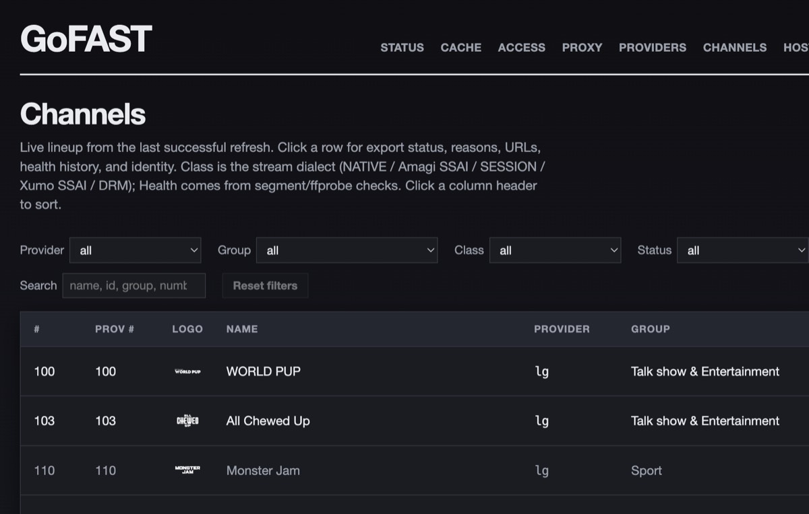
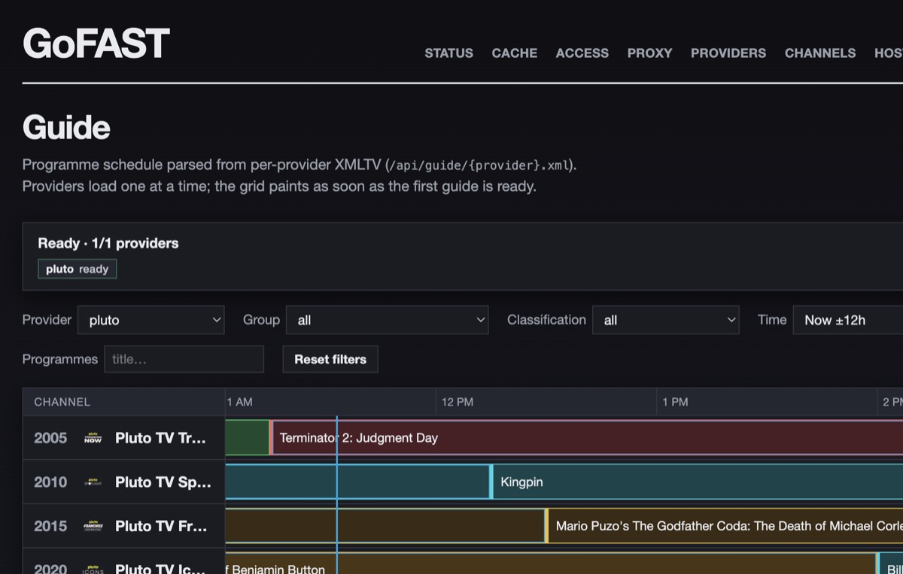

# GoFAST

**Self-hosted FAST TV for Jellyfin** — one lineup, one guide, channels that actually play.

License: [MIT](LICENSE)

FAST (Free Ad-Supported Streaming TV) catalogs are everywhere — LG Channels, Pluto, Samsung TV Plus, Roku, Xumo, Tubi, and more — but wiring them into Jellyfin Live TV is painful. Each source has its own playlist shape, numbering quirks, and stream dialects. Some play fine as plain HLS. Others use Amagi “beacon” segment URLs that **ffmpeg/Jellyfin reject**. Still others need a Google DAI session mint on every tune-in. Stitching that together by hand means fragile M3U files, silent guide gaps, and channels that look fine in a browser but die in Live TV.

**GoFAST fixes that.** It pulls lineups and EPG from multiple FAST providers, normalizes and filters them, classifies each stream by playback path, and serves Jellyfin-ready **M3U + XMLTV** over HTTP. An optional proxy sits only where media clients need help — so Amagi and SESSION channels play instead of 404 / exit 234 — while native and Xumo streams stay direct when they can.

| Piece | Role |
|-------|------|
| **fastgen** | Primary product: providers → cache → M3U/XMLTV, health, logos, embedded operator UI |
| **fastproxy** | Optional add-on: Amagi beacon rewrite + Google DAI SESSION mint for Jellyfin/ffmpeg |

Gen works standalone. Add the proxy when you want Amagi / SESSION playback (or full `proxy_all` observability).

---

## Why it exists

- **One coherent lineup beats ten portals** — Jellyfin can take many M3U/XMLTV sources, but juggling separate vendor playlists means colliding numbers, duplicate brands, and dialect gaps. GoFAST merges that into one guide-friendly lineup.
- **Upstream formats disagree** — numbers, logos, groups, DRM, SSAI, mint-on-tune.
- **ffmpeg is strict** — extensionless Amagi beacon URIs fail on modern Jellyfin ([jellyfin#17400](https://github.com/jellyfin/jellyfin/issues/17400)); GoFAST rewrites them so Live TV can play.
- **Homelab operators need control** — enable/disable providers, exclude junk, prefer one copy of “CNN”, probe health, and keep last-known-good when an upstream blips.

GoFAST is built for that operator: Docker Compose / Portainer, persistent cache, live settings UI, no cloud account required.

## Screenshots

|  |  |
|:---:|:---:|
| Status | Providers |
|  |  |
| Channels | Guide |

---

## Features

### Lineups & guides for Jellyfin

- Aggregate **`/playlist.m3u`** + **`/epg.xml`**, or per-provider `/{id}.m3u` + `/{id}.xml`
- Stable channel numbers (offsets / synthesize), namespaced aggregate IDs, XMLTV with Now/Next-friendly programmes
- Last-known-good generations — failed refreshes keep serving so Jellyfin isn’t left empty

#### Built-in providers (where data comes from)

Providers are **Go packages compiled into fastgen** — not plugins. YAML only overlays settings (enable, offsets, URL overrides). Defaults below are what the binary fetches unless you override `channels_url` / `epg_url` / `m3u_url`.

| Id | Brand | Upstream source | Default fetch |
|----|-------|-----------------|---------------|
| `lg` | LG Channels | **LG Channels API** (official schedulelist) | `https://api.lgchannels.com/api/v1.0/schedulelist` — channels + programmes in one payload |
| `pluto` | Pluto TV | **[i.mjh.nz](https://i.mjh.nz)** (Matt Huisman) + **jmp2.uk** stream CDN | Channels `https://i.mjh.nz/PlutoTV/.channels.json.gz`; EPG `…/PlutoTV/us.xml.gz`; streams `https://jmp2.uk/plu-{id}.m3u8` |
| `samsung` | Samsung TV Plus | i.mjh.nz + jmp2.uk | `https://i.mjh.nz/SamsungTVPlus/.channels.json.gz` + `…/us.xml.gz`; stream slug from metadata (e.g. `stvp-{id}`) on jmp2.uk |
| `roku` | The Roku Channel | i.mjh.nz + jmp2.uk | `https://i.mjh.nz/Roku/.channels.json.gz` + regionless EPG `…/Roku/all.xml.gz`; streams `https://jmp2.uk/rok-{id}.m3u8` |
| `plex` | Plex FAST | i.mjh.nz + jmp2.uk | `https://i.mjh.nz/Plex/.channels.json.gz` + `…/Plex/us.xml.gz`; streams `https://jmp2.uk/plex-{id}.m3u8` |
| `xumo` | Xumo Play | **Published M3U + XMLTV** ([BuddyChewChew/xumo-playlist-generator](https://github.com/BuddyChewChew/xumo-playlist-generator)) | `…/playlists/xumo_playlist.m3u` + `…/xumo_epg.xml.gz` on GitHub raw |
| `tubi` | Tubi | Published pair ([BuddyChewChew/app-m3u-generator](https://github.com/BuddyChewChew/app-m3u-generator)) | `…/playlists/tubi_all.m3u` + `…/tubi_epg.xml` |
| `tcl` | TCL channels | Published pair ([BuddyChewChew/tcl-playlist-generator](https://github.com/BuddyChewChew/tcl-playlist-generator)) | `…/tcl.m3u8` + `…/tcl_epg.xml` |
| `distrotv` | DistroTV | Published pair ([vraomoturi/DistroTV](https://github.com/vraomoturi/DistroTV)) | `…/distrotv.m3u` + `…/distrotv.xml.gz` — many streams are Google DAI (**SESSION**; needs fastproxy) |
| `localnow` | LocalNow | M3U from **apsattv.com**; EPG from BuddyChewChew | `https://www.apsattv.com/localnow.m3u` + GitHub `…/localnow-playlist-generator/…/epg.xml` |

**Three fetch strategies in code:** LG’s own API; shared MJH JSON+XMLTV (`internal/provider/mjh`); shared published M3U/XMLTV pairs (`internal/provider/published`). Community scrapes can break when upstream generators change — GoFAST keeps last-known-good when a refresh fails. Full dialect/gotcha notes: [docs/SPEC.md](docs/SPEC.md).

### Stream dialects that match how playback actually works

| Dialect | What happens |
|---------|----------------|
| **NATIVE** | Emit upstream URL — plays directly |
| **XUMO_SSAI** | Emit upstream with `ads.*` kept — usually no proxy |
| **AMAGI_SSAI** | Needs **fastproxy** rewrite (extensionless beacons → `/seg/….ts`) |
| **SESSION** | Needs **fastproxy** DAI mint, then 302 to a fresh manifest |
| **DRM** | Dropped — no proxy can help |

Optional **`proxy_all`**: every tune starts at the proxy (better observability; proxy becomes critical for all channels). Default is selective: proxy only Amagi + SESSION.

### Operator UI (embedded)

Embedded SPA in the fastgen binary — see [screenshots](#screenshots) for Status, Providers, Channels, and Guide.

- **Channels / Providers / Guide** — browse lineup, per-channel detail, HLS preview (raw vs emitted)
- **Status filters that match how export works** — In lineup / Via proxy, plus why something is out (Duplicate, Needs proxy, DRM, disabled group, emit disabled, regex, …). A channel can show **multiple** reasons at once
- **Absent** — channels dropped from a provider catalog stay findable (ghost rows + presence history); Status shows Absent now / Dropped (7d)
- **Config** — live settings (no restart for app knobs): providers, health, ops report SMTP, groups, categories, logos, proxy URLs, per-channel emit overrides
- **Groups / Categories** — taxonomy so upstream folders and programme genres become consistent emitted labels. Jellyfin Live TV only maps categories into **four** guide flags (Movies / Children’s / News / Sports) via pipe-delimited match lists on the listings provider — align Categories merge names with those lists (or extend Jellyfin’s lists to cover what you emit); GoFAST stays client-agnostic and does not ship Jellyfin-specific category knobs.
- **Dedupes** — same-title clusters across providers; prefer / drop so you don’t keep five “BET”s (losers marked Duplicate, distinct from manual emit-disable)
- **Health** — scheduled L1 segment probes + optional L2 ffprobe; history and on-demand tests
- **Cache** — disk inventory (generations, logo **file count + size**, attr history); soft purge & logo clear without a serving gap
- **Access / Proxy / Status** — who pulled your playlists, proxy events, build identity, logo warm progress, lineup problem rollups, ops-report schedule when enabled

### Daily ops-report email

Optional once-per-local-day digest so you can see overnight refresh/health/lineup churn without opening the UI. Off by default; enable under **Config → Ops report** (or `ops_report` in YAML).

| Piece | Behavior |
|-------|----------|
| **Schedule** | IANA timezone + local `HH:MM` (default `America/Los_Angeles` / `00:00`). DST-aware; 2h grace catch-up if gen was down at send time. One official send per local calendar day. |
| **Delivery** | Multipart plain text + rich HTML (matches the dark operator UI). SES-friendly SMTP (`host` / `port` / STARTTLS / username / password). Prefer `FASTGEN_SMTP_PASSWORD` (and optional `FASTGEN_SMTP_USERNAME`) — env wins and locks the Config field. |
| **Subject** | `GoFAST ops report — YYYY-MM-DD` (local date; timezone lives in the body). |
| **Always send** | Even when deltas are empty (“no changes in window”). |
| **Fleet snapshot** | Per-provider refresh outcome / age, durable refresh success/fail tallies since the last official send, channel health rollup (healthy / degraded / down / untested). |
| **Channel deltas** | Adds, drops, classification changes, and health **status transitions** (not every probe tick) since the prior successful send — backed by the channel-attr store. |
| **Manual actions** | **Test SMTP** (smoke, not archived); **Generate and Send Report** (full preview: archived, does not advance `last_success` or reset tallies); **Resend** from the 90-day archive under `{data_dir}/ops_reports/`. |
| **APIs** | `/api/ops-report/*` (schedule, archives, resend, test-smtp, send-preview). Status UI shows last/next when enabled. |

### Reliability & ops

- Atomic cache generations under `/data` — playlist and guide publish as a pair
- Soft purge keeps the current generation until refresh commits
- **`min_channels`** gates on **upstream catalog** size (before Dedupes / emit-disable / dialect filters), not the exported M3U count — editable per provider in Config; Providers UI shows Catalog vs Exported; `/healthz` exposes both
- **Channel attributes** (health, classification, catalog **presence**) in SQLite outside generations — durable add/drop history for digests and the UI
- Optional logo cache + rewrite to your `FASTGEN_BASE_URL` (clients never hit upstream CDNs)
- Client-access log for Jellyfin pulls of root M3U/XMLTV
- Prometheus `/metrics`, rich `/healthz`, compose profiles: gen-only, `proxy`; works behind a reverse proxy for TLS
- Twelve-factor config: env for deploy knobs, optional YAML for structure; UI edits apply live
- Prefer `FASTGEN_SMTP_PASSWORD` (and optional `FASTGEN_SMTP_USERNAME`) for ops-report credentials — env wins over YAML

### What you get in Jellyfin

1. Point Live TV at GoFAST’s M3U + XMLTV  
2. Browse a merged FAST guide  
3. Tune channels — native/Xumo direct; Amagi/SESSION via proxy when configured  
4. Operate everything from the UI on the same host  

---

## Docs

| Doc | Contents |
|-----|----------|
| [docs/SPEC.md](docs/SPEC.md) | Requirements, dialects, gotchas |
| [docs/ARCHITECTURE.md](docs/ARCHITECTURE.md) | Dual-binary design, persistence, milestones |
| [docs/TERMINOLOGY.md](docs/TERMINOLOGY.md) | Glossary (HLS, SSAI, dialects, mint, proxy URLs) |
| [AGENTS.md](AGENTS.md) | Agent workflow: GitHub Issues, branches, PRs, quality gates |

---

## Install & operate

Images are published to GHCR on every merge to `main` (after UI build + compile + test pass):

| Service | Image tags |
|---------|------------|
| fastgen | `…/fastgen:latest`, `…/fastgen:build-N`, `…/fastgen:sha-<short>` |
| fastproxy | `…/fastproxy:latest`, `…/fastproxy:build-N`, `…/fastproxy:sha-<short>` |

`N` is the GitHub Actions run number (monotonic). Pin Portainer / `stack.env` with `IMAGE_TAG=build-N`. Running build identity is on `GET /healthz` (`version.build` / `version.commit`) and Status → System.

Default ports: **8180** (gen), **8181** (proxy). Front with your own reverse proxy for HTTPS if you want TLS.

### Topologies

| Mode | Compose | Playback |
|------|---------|----------|
| **Gen-only** (default) | `docker compose up` | NATIVE / Xumo SSAI direct; Amagi SSAI + SESSION filtered until proxy is configured |
| **Gen + proxy** | `docker compose --profile proxy up` (or `COMPOSE_PROFILES=proxy`) | Set `FASTGEN_PROXY_BASE_URL` to the proxy origin **reachable by Jellyfin/ffmpeg** (embedded in M3U). Behind TLS, ensure playlist rewrite stays on https — see [TLS / reverse proxy](#tls--reverse-proxy-optional). Proxy uses internal `FASTPROXY_GEN_URL` (e.g. `http://fastgen:8180`) for origin pull + telemetry. Amagi → rewrite; SESSION → DAI mint then 302 |

**Four proxy-related URLs (do not conflate):**

| Knob | Who uses it | Typical local compose |
|------|-------------|------------------------|
| `FASTGEN_PROXY_BASE_URL` / `proxy_base_url` | Jellyfin/browser (M3U emit) | `http://localhost:8181` |
| `FASTPROXY_PUBLIC_BASE_URL` | Proxy playlist rewrite (`/s`, `/seg`) when set | unset locally; optional `https://…` behind TLS |
| `FASTGEN_PROXY_INTERNAL_URL` / `proxy_internal_url` | Gen health probes (Manual L2) rewrite | `http://fastproxy:8181` (compose default) |
| `FASTPROXY_GEN_URL` | Proxy → gen (origins + event push) | `http://fastgen:8180` |

`localhost` in `proxy_base_url` is fine for host players; gen inside Docker cannot dial that loopback for L2 — that is what `proxy_internal_url` fixes. Status/Proxy glass does not need gen→proxy; it uses proxy→gen events.

There is no single-process gen+proxy mode. Gen is light (periodic pulls + emit); proxy is network-I/O byte shuttling.

**`proxy_all` (optional, off by default):** emit every channel URL through the proxy. NATIVE / XUMO get a 302 to upstream (no media through proxy); Amagi is fully rewritten; SESSION is minted then 302’d to `stream_manifest`. Tradeoff: better playback observability and drift insulation, but the proxy becomes availability-critical for **all** channels. Default remains selective proxying (**Amagi + SESSION**).

**UI:** Status shows a compact proxy heartbeat glance; the **Proxy** tab is the detailed event glass. Playlist/origin failures also move channel health badges (`source=playback`).

### Homelab (pull published images)

Use [`docker-compose.prod.yml`](docker-compose.prod.yml) (pull-only; no build). Source is public. If anonymous `docker pull` from GHCR fails (package visibility), log in once with a PAT that has `read:packages`:

```bash
# Only needed when GHCR packages are not public:
echo YOUR_PAT | docker login ghcr.io -u YOUR_GITHUB_USERNAME --password-stdin

docker compose -f docker-compose.prod.yml --env-file stack.env pull
docker compose -f docker-compose.prod.yml --env-file stack.env up -d
curl http://localhost:8180/healthz
```

CI builds UI + binaries inside `node:22-bookworm` / `golang:1.26.5-bookworm` (same pins as local `Dockerfile`), then packages with [`Dockerfile.prod`](Dockerfile.prod) into GHCR.

### Portainer (homelab stack)

Production files (pull-only, no secrets):

| File | Purpose |
|------|---------|
| [`docker-compose.prod.yml`](docker-compose.prod.yml) | Portainer stack compose (pull GHCR; no `build:`) |
| [`stack.env`](stack.env) | Non-secret defaults (`IMAGE_TAG`, ports, optional bind path) |
| [`Dockerfile.prod`](Dockerfile.prod) | CI ship path only — not used on the homelab host |

1. If GHCR packages are private, add `ghcr.io` in Portainer → **Registries** with a GitHub PAT (`read:packages`). Skip if packages are public.
2. Create a stack from `docker-compose.prod.yml` (services: `gen`, optional `proxy`).
3. Paste or load `stack.env` as the stack environment variables.
4. Gen-only by default. Enable proxy with `COMPOSE_PROFILES=proxy`.
5. Optional: set `FASTGEN_DATA=/path/on/host` for a bind mount instead of the named volume.
6. Set `FASTGEN_BASE_URL` to the public origin Jellyfin uses (include `:port` unless on 80/443; no trailing slash), e.g. `http://192.168.1.50:8180` or `https://gofast.example.com`.
7. When enabling the proxy profile, set `FASTGEN_PROXY_BASE_URL` to the public proxy origin Jellyfin/ffmpeg can reach, e.g. `http://192.168.1.50:8181` or `https://gofast-proxy.example.com`. Optionally set `FASTGEN_PROXY_ALL=true`.
8. Smoke test: `curl http://HOST:8180/healthz` → JSON with `"ok": true` plus per-provider stale/export fields (Docker/Portainer healthcheck only requires HTTP 200). Prometheus scrapes `GET /metrics` on the same port.

### HTTP endpoints

| Path | Purpose |
|------|---------|
| `/{id}.m3u` | Per-provider M3U playlist (`lg`, `pluto`, `samsung`, `roku`, `plex`, `xumo`, `tubi`, `tcl`, `distrotv`, `localnow`) |
| `/{id}.xml` | Per-provider XMLTV guide |
| `/playlist.m3u` | Aggregate playlist across enabled providers |
| `/epg.xml` | Aggregate XMLTV across enabled providers |
| `/logos/{provider}/{file}` | Cached logos when `cache_logos` is on |
| `/api/cache` | Cache inventory (sizes, logo file counts, generations, channelattr stats) |
| `/api/ops-report/*` | Ops-report schedule, archives, test SMTP, preview send, resend |
| `/` | Embedded operator UI |
| `/healthz` | Liveness + per-provider catalog/export counts and stale status |
| `/metrics` | Prometheus text exposition |

Channel detail includes an HLS **Preview** player (raw upstream vs emitted
playback URL). Prefer Emitted when the channel is via FASTProxy — proxy
`/stream` responses send CORS headers so the browser can audition them.

### Jellyfin Live TV (gen-only)

1. Bring the stack up (prod or local compose). Local compose auto-seeds `./.data/config.yaml` from [`config.example.yaml`](config.example.yaml) on first run (a `seed-config` init service), so all providers are enabled out of the box. In prod, copy [`config.example.yaml`](config.example.yaml) to `/data/config.yaml` before first boot; otherwise fastgen generates a defaults-only `config.yaml` with **no providers enabled**.
2. Set `FASTGEN_BASE_URL` to the origin **Jellyfin can reach** (LAN `http://HOST:8180` or HTTPS behind a reverse proxy — see [TLS / reverse proxy](#tls--reverse-proxy-optional)). No trailing slash.
3. Wait until providers have last-known-good data: open the UI, or `curl …/healthz` and check per-provider `exported_channels` / `fetched_at`. Failed refreshes keep serving the previous M3U/XMLTV so Jellyfin is not left empty.
4. In Jellyfin: **Dashboard → Live TV → Tuners → Add** → type **M3U Tuner** → URL:
   - Aggregate: `http://HOST:8180/playlist.m3u` or `https://gofast.example.com/playlist.m3u`
   - Single provider: `…/lg.m3u` (etc.)
5. **Guide data** → add **XMLTV** → matching guide URL:
   - Aggregate: `http://HOST:8180/epg.xml` or `https://gofast.example.com/epg.xml`
   - Single provider: `…/lg.xml` (etc.)
6. Gen-only serves **NATIVE** and **Xumo SSAI** streams directly.
   **Amagi SSAI** (`AMAGI_SSAI`, legacy `BEACON`) and **SESSION** (Google DAI mint)
   need FASTProxy — see [docs/TERMINOLOGY.md](docs/TERMINOLOGY.md).
   (`COMPOSE_PROFILES` including `proxy` + `FASTGEN_PROXY_BASE_URL`). **DRM**
   stays dropped.

### TLS / reverse proxy (optional)

GoFAST is happy behind any reverse proxy that terminates TLS (Caddy, Traefik, HAProxy, etc.). Keep the public origin on **HTTPS** — do not expose plaintext ports just so clients can fetch rewritten media URIs.

**Gen** never invents absolute URLs from `Host` / `X-Forwarded-*`. Always set `FASTGEN_BASE_URL` (and `FASTGEN_PROXY_BASE_URL` when using FASTProxy) to the public HTTPS origin Jellyfin reaches.

**FASTProxy playlist rewrite** is different: Amagi rewrites mint absolute `/s/…` and `/seg/….ts` URIs. Behind TLS termination the container often sees plain HTTP from the proxy, so without help those URIs become `http://…` and Jellyfin/ffmpeg fail. Use **either** of the following (both is fine):

| Option | What to set | When it wins |
|--------|-------------|--------------|
| **A — Forwarded headers** | On the FASTProxy vhost, forward `X-Forwarded-Proto` (and preferably `X-Forwarded-Host`) | Used when `FASTPROXY_PUBLIC_BASE_URL` is unset |
| **B — Explicit public base** | `FASTPROXY_PUBLIC_BASE_URL=https://gofast-proxy.example.com` on the **proxy** container (same origin as `FASTGEN_PROXY_BASE_URL`) | Always preferred when set; ignores request scheme |

Quick check after deploy — every rewritten line must be `https://…`:

```bash
curl -sS 'https://gofast-proxy.example.com/stream/<provider>/<id>.m3u8' | head -20
```

### Config (`/data/config.yaml`)

Runtime YAML on the gen data volume (not baked into the image). **Provider implementations are code** — each is a package compiled into the binary. This file only *customizes* a known provider (offsets, exclusions, enabled, URL overrides); it cannot add a provider without shipping Go, and ids with no implementation are ignored (warned) at startup. See [Built-in providers](#built-in-providers-where-data-comes-from) for each id and the default upstream URL(s). Every provider runs only when its YAML block is present; `enabled: false` disables an existing block. A fresh `/data` with no `config.yaml` generates a defaults-only file with no providers enabled.

`config.yaml` is **operator-writable** — mount `/data` read-write. If the file is missing on first boot, fastgen generates it from the baked-in code defaults (deploy-varying values stay in the environment). App-managed settings are persisted back atomically, preserving your comments and any keys fastgen does not manage (a `.bak` of the prior file is kept). A read-only mount surfaces a clear "config is read-only" message instead of failing.

**Settings UI (live, no restart):** the web UI's **Config** page edits settings as typed controls and applies them live — base/proxy URLs, logo caching, log level, all health knobs, **ops report** (schedule + SMTP non-secrets), the **Groups** taxonomy, **Dedupes** (same-title cross-provider prefer/drop via `channel_emit`), and every per-provider setting including enable/disable and **`min_channels`** (disable stops fetches, hides the channels, and 404s `/{id}.m3u`; the cache is kept so re-enabling is instant). The **Cache** page inventories on-disk generations, logo file count/size, and channelattr history depth, and offers soft purge / logo clear (also on Config, Provider detail, and Channel detail). Soft purge keeps the serving generation until refresh commits. The rule is: **edit in the UI = applies live; hand-edit the file = restart the container.** `listen`/`PORT` and `data_dir` are restart-only by design and have no UI control. Values set via environment variables show as locked in the UI (env always wins).

- [`config.example.yaml`](config.example.yaml) — starter template with the well-known provider overlays. Local compose auto-seeds it into `./.data/config.yaml` on first run (`seed-config` service); delete that file to re-seed. In prod, copy it to `/data/config.yaml` before first boot; otherwise a defaults-only file with no providers enabled is generated.

The selected last-known-good generation keeps exact upstream files under `/data/cache/{id}/generations/{generation}/raw/`: LG stores `schedule.json`; MJH providers store `channels.json.gz` + `guide.xml.gz`; published-pair providers store `playlist.m3u` plus `guide.xml.gz` (Xumo/DistroTV) or `guide.xml` (LocalNow/Tubi/TCL). Published-pair refreshes log normalized playlist/guide ID match rates. Numberless channels use stable, persisted first-seen assignments from each provider's `synthesize_channel_numbers` base; removed IDs stay reserved.

Deploy-specific values (`PORT`, `FASTGEN_BASE_URL`, `FASTGEN_PROXY_BASE_URL`, `FASTGEN_PROXY_ALL`, `FASTGEN_CACHE_LOGOS`, …) stay in env — see `AGENTS.md`. `proxy_base_url` is the public FASTProxy origin; Amagi SSAI and SESSION channels are filtered with an explicit reason when it is absent. `proxy_all` defaults off.

**Logos:** `cache_logos` / `FASTGEN_CACHE_LOGOS` defaults **false** (upstream CDN URLs unchanged). When true (Config: “Cache + rewrite logos”), logos download under `{data_dir}/cache/{provider}/logos` and M3U/XMLTV/API — including per-channel emit `logo_url` — rewrite to `{FASTGEN_BASE_URL}/logos/...` (requires `base_url`). Soft artwork failures may leave a CDN URL until the next successful warm. Artwork-only TLS exceptions live under `artwork_tls` in YAML — they never apply to stream or EPG fetches.

### Local build from source

Full rebuild via [`Dockerfile`](Dockerfile) (Node + Go multi-stage — same image pins as CI):

```bash
docker compose build
docker compose up -d
```

Or build UI/Go on the host, then run the binary:

```bash
cd web && npm ci && npm run build && cd ..
go run ./cmd/fastgen
# open http://localhost:8180/
```

## Status

Ten baked-in providers (LG API, i.mjh.nz/jmp2.uk, and published M3U/XMLTV pairs) — see [Built-in providers](#built-in-providers-where-data-comes-from).
