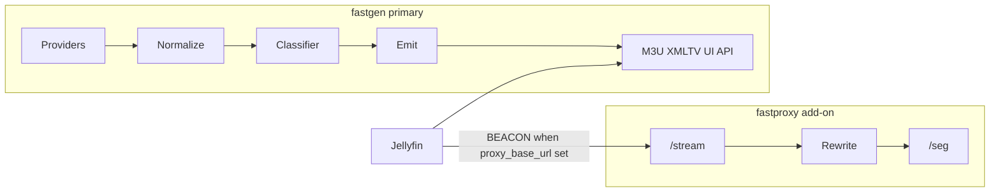
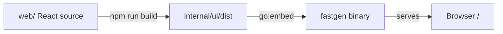

# GoFAST architecture

Self-hosted FAST channel aggregator for Jellyfin: **FASTGen** (primary) produces M3U + XMLTV; **FASTProxy** (optional add-on) rewrites Amagi SSAI “beacon” HLS so ffmpeg/Jellyfin can play it.

Module: [`github.com/j27-aurum/gofast`](https://github.com/j27-aurum/gofast)

Work queue and milestones: [Linear — GoFAST](https://linear.app/aurum-alpha/project/gofast-7332d71ee889/overview)  
Agent workflow: [`AGENTS.md`](../AGENTS.md)  
Product detail / gotchas: [`docs/SPEC.md`](SPEC.md)

## Dual binary, dual image

One Go module, **two** entrypoints and Docker images:

| Binary | Image | Role |
|--------|-------|------|
| `cmd/fastgen` | `fastgen` | Primary: providers, classifier, M3U/XMLTV writers, logos, health, embedded UI |
| `cmd/fastproxy` | `fastproxy` | Add-on: HLS rewrite, beacon resolve, segment shuttle |

Shared logic lives under `internal/` (model, config, httpx, classifier, etc.). There is **no** single binary with `--enable-gen/--enable-proxy` flags.

### Compose topologies

- **Gen-only (default):** `docker compose up` runs `fastgen` on port 8180 with `/data` for config, cache, logos.
- **Gen + proxy:** `docker compose --profile proxy up` also runs `fastproxy` on 8181. Set `proxy_base_url` in gen config to the address **reachable by Jellyfin/ffmpeg** (not merely by gen).

## Data flow



**Classifier buckets** (at refresh): `NATIVE` | `BEACON` | `DRM`

**Emission (in gen):**

- `NATIVE` → upstream URL (unless `proxy_all`)
- `DRM` → always drop
- `BEACON` → `{proxy_base_url}/stream/{provider}/{id}.m3u8` if configured; else drop (UI shows “needs FASTProxy”)

## UI feathering

The embedded UI ships early and grows with each milestone (no big-bang UI epic):

| Milestone | UI surface |
|-----------|------------|
| M0 | Shell, nav, empty states |
| M1 | Channel list + classification badges |
| M2 | Export status, filter reasons, provider rollups |
| M3 | Health column, probe history, Test now |
| M4 | Config editor + formal acceptance |
| M5 | Proxy-aware states / passive health views |

Tech: React (Vite) SPA under `web/`. Production build lands in `internal/ui/dist` and is **`go:embed`’d into the fastgen binary**, which serves the static files (SPA fallback for client routes). Node is a **build-time** dependency only. Runtime is one static Go binary — no Node in the container. Proxy has no product UI.



## Build and packaging

**Production images must not recompile.** CI is the build authority; `Dockerfile.prod` only packages artifacts.

| Stage | What runs | Output |
|-------|-----------|--------|
| CI — UI | Node 22, `npm ci && npm run build` in `web/` | `internal/ui/dist` |
| CI — Go | Go 1.26.5, `CGO_ENABLED=0`, linux binaries | `bin/fastgen`, `bin/fastproxy` (UI already inside fastgen) |
| CI — gofmt | `gofmt -l .` must be empty | pass/fail gate |
| CI — test | `go test ./...` (after UI build so embed is present) | pass/fail gate |
| CI — image | `Dockerfile.prod` copies binaries + ca-certs (+ healthcheck wget) into distroless | GHCR `…/fastgen`, `…/fastproxy` |

Why this works: both artifacts are **standalone** — static Go (`CGO_ENABLED=0`) with the UI baked in, so the image runtime (distroless) does not need a matching glibc/Node toolchain. The only contract is **GOOS/GOARCH** (and any future libc choice): CI must build for the platforms you deploy (today: `linux/amd64` on `ubuntu-latest`; add `arm64` later if a NAS/Pi needs it).

| File | Role |
|------|------|
| `Dockerfile.prod` | **Ship path** — copy CI binaries into distroless; used by CI to push GHCR |
| `Dockerfile` | **Local/dev** — multi-stage Node + Go build from source (`docker compose build`) |
| `docker-compose.yml` | Local/dev (build via `Dockerfile` or pull) |
| `docker-compose.prod.yml` | Homelab/Portainer — **pull GHCR only** (no build) |

CI compile/test use GitHub-hosted Node **22** and Go **1.26.5** (same pins as the local `Dockerfile` image). Production images are packaged only via `Dockerfile.prod` from those CI binaries. Homelab never builds from source for production; it pulls `:latest` / pinned `IMAGE_TAG` after logging into GHCR.

## Config

Follow [12factor.net/config](https://12factor.net/config) (see `AGENTS.md`):

- **Deploy-varying values** → environment. Shared: **`PORT`** (listen) for both gen and proxy. Gen-only: `FASTGEN_BASE_URL`, `FASTGEN_DATA_DIR`, `FASTGEN_PROXY_BASE_URL`, `FASTGEN_PROXY_ALL`, `FASTGEN_CACHE_LOGOS`. Env always wins.
- **`FASTGEN_BASE_URL` / `base_url`:** public origin for logos and absolute links as seen by Jellyfin/browsers. Include the port unless on 80/443 (`http://host:8180`); omit port behind TLS reverse proxy (`https://gofast.example.com`). No trailing slash. Required when `cache_logos` is enabled.
- **`FASTGEN_CACHE_LOGOS` / `cache_logos`:** when true, download logos to `{data_dir}/cache/{provider}/logos` and rewrite M3U/XMLTV/API logo URLs to `{base_url}/logos/...`. Default false (upstream CDN URLs unchanged). Logos live outside generations so they survive refresh commits; local compose bind-mounts `./cache` only.
- **`FASTGEN_PROXY_BASE_URL` / `proxy_base_url`:** public FASTProxy origin as reached by Jellyfin/ffmpeg. It is canonicalized without a trailing slash. `FASTGEN_PROXY_ALL` / `proxy_all` defaults false and requires a proxy base URL when enabled.
- **Optional YAML** on the data volume: `/data/config.yaml` for structured, non-secret settings. Provider *implementations* are code (packages under `internal/provider/<id>` exposing `New` + `DefaultSettings`, wired into a `map[id]provider.Reader`); the `providers` block only *overlays settings* for a known provider and cannot add one without shipping Go (unknown ids are ignored/warned). LG preserves its existing default; MJH providers (Pluto, Samsung, Roku) and published-pair providers (Xumo, DistroTV, LocalNow) require their YAML block and may be disabled explicitly. Runtime data only — ship `config.example.yaml` as a template; never commit a filled production file.
- **Generated artifacts** live under `{data_dir}/cache/`, owned entirely by `internal/cache` (the only package that touches disk). Each provider uses immutable generations selected by an atomic `current` pointer. A generation contains `playlist.m3u`, `guide.xml`, lean `meta.json`, and exact upstream payloads under `raw/` (`schedule.json` for LG; `channels.json.gz` + `guide.xml.gz` for MJH; `playlist.m3u` + `guide.xml[.gz]` for published pairs). `meta.json` retains fetched time, classifications, and historical synthetic channel-number assignments; `status.json` remains outside the generation. The combined aggregate uses the same generation/`current` model under `aggregate/` (`playlist.m3u` + `epg.xml` as one pair). Legacy root-level aggregate files remain readable until the next rebuild. Emitters are deterministic: channels are globally sorted by positive final number with unnumbered rows last, aggregate ids are provider-namespaced, and XMLTV is re-parsed plus semantically checked before publication. `<lcn>` is an intentional non-DTD compatibility extension; Jellyfin numbering comes from M3U `tvg-chno`. On boot fastgen reparses the selected raw files, restores irreproducible metadata, regenerates outputs under the current emission config, and resumes the refresh interval without a network call. An empty aggregate rebuild (no exportable channels) leaves the prior aggregate generation untouched. Keep the cache on a persistent volume/bind mount.
- **Refresh logging:** success and failure slog lines include `duration`; each provider logs next upstream refresh ETA every 5 minutes (`next_refresh_at` / `refresh_in`).
- **Published-pair validation:** Xumo, DistroTV, and LocalNow parse shared EXTINF/XMLTV inputs, sanitize upstream bare ampersands, normalize joins, and log playlist-to-guide ID match rates. Numberless channels receive stable first-seen assignments from each provider's configured synthesis base; removed IDs remain reserved and playlist order never determines identity.
- **Precedence:** code defaults → YAML (if present) → **env**.
- **Grow config with features:** add proxy / logo TLS / health keys only in the PRs that implement those features; extend `config.example.yaml` there. No standalone ahead-of-time config-layer issues.

Deps target: **stdlib + `gopkg.in/yaml.v3`** only unless an issue justifies more.

## Milestones (Linear)

| Milestone | Focus |
|-----------|--------|
| **M0** | Spec, dual cmds, Docker stubs, UI shell, core+provider config |
| **M1** | Model/normalize, providers, classifier, early channel UI |
| **M2** | Refresh/emit, logos (+ TLS config), gen HTTP, export UI, Jellyfin-ready gen image |
| **M3** | Health subsystem (+ health config) + health UI; ffprobe in fastgen image |
| **M4** | Config editor polish + &lt;10s acceptance |
| **M5** | fastproxy binary/image, compose profile, passive telemetry |

Honor milestone order and Linear **blocked-by** links. Critical path to a Jellyfin-usable feed ends at M2 gen HTTP + production compose/README.

**Vertical slice first:** prove one provider end-to-end (LG: registry → fetch → emit → `GET /{id}.m3u|.xml`) before adding more adapters (mjh / published-pair). Do not stack all adapters ahead of a callable playlist.

## Package layout (target)

```
cmd/fastgen/
cmd/fastproxy/
internal/
  config/ model/ httpx/
  provider/   # lg; shared mjh wrappers; shared published-pair wrappers
  m3u/ xmltv/ # external-format parsers and writers
  classifier/
  health/     # M3+
  logocache/ refresh/
  proxy/      # M5
  server/ ui/   # ui embeds Vite dist from web/
web/            # React + Vite source (build → internal/ui/dist)
testdata/
config.example.yaml
Dockerfile.prod     # production: package CI-built binaries only (no Node/Go rebuild)
Dockerfile          # optional local multi-stage build from source
docker-compose.yml
docker-compose.prod.yml
stack.env
.github/workflows/  # UI build → go build → test → Dockerfile.prod → GHCR
```

Homelab pull requires `docker login ghcr.io` while the repo/packages are private.

## Operational notes

- Outbound calls: timeouts (default 60s), retry with backoff; stream probes use **ranged GET**, never HEAD.
- Last-known-good cache under `/data/cache/`; when `cache_logos` is on, durable logos under `/data/cache/{provider}/logos/` (served at `GET /logos/{provider}/{file}`).
- Artwork-only TLS exceptions (extra CA / insecure skip) must never apply to stream or EPG clients.
- `proxy_all` (default off): all exported URLs go through proxy; NATIVE gets 302 upstream. Makes proxy availability-critical for all channels.
