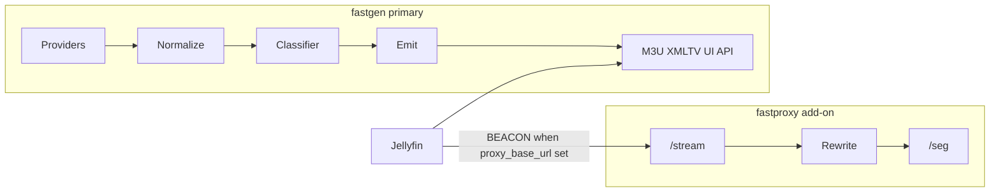

# GoFAST architecture

Self-hosted FAST channel aggregator for Jellyfin: **FASTGen** (primary) produces M3U + XMLTV; **FASTProxy** (optional add-on) rewrites Amagi SSAI “beacon” HLS so ffmpeg/Jellyfin can play it.

Module: [`github.com/j27-aurum/gofast`](https://github.com/j27-aurum/gofast)

Work queue and milestones: [Linear — GoFAST](https://linear.app/aurum-alpha/project/gofast-7332d71ee889/overview)  
Agent workflow: [`AGENTS.md`](../AGENTS.md)  
Product detail / gotchas: [`docs/SPEC.md`](SPEC.md)

## Dual binary, dual image

One Go module, **two** entrypoints and Docker images:

| Binary | Image | Role |
|--------|-------|------|
| `cmd/fastgen` | `fastgen` | Primary: providers, classifier, emit M3U/XMLTV, logos, health, embedded UI |
| `cmd/fastproxy` | `fastproxy` | Add-on: HLS rewrite, beacon resolve, segment shuttle |

Shared logic lives under `internal/` (model, config, httpx, classifier, etc.). There is **no** single binary with `--enable-gen/--enable-proxy` flags.

### Compose topologies

- **Gen-only (default):** `docker compose up` runs `fastgen` on port 8180 with `/data` for config, cache, logos.
- **Gen + proxy:** `docker compose --profile proxy up` also runs `fastproxy` on 8181. Set `proxy_base_url` in gen config to the address **reachable by Jellyfin/ffmpeg** (not merely by gen).

## Data flow



**Classifier buckets** (at refresh): `NATIVE` | `BEACON` | `DRM`

**Emission (in gen):**

- `NATIVE` → upstream URL (unless `proxy_all`)
- `DRM` → always drop
- `BEACON` → `{proxy_base_url}/stream/{provider}/{id}.m3u8` if configured; else drop (UI shows “needs FASTProxy”)

## UI feathering

The embedded UI ships early and grows with each milestone (no big-bang UI epic):

| Milestone | UI surface |
|-----------|------------|
| M0 | Shell, nav, empty states |
| M1 | Channel list + classification badges |
| M2 | Export status, filter reasons, provider rollups |
| M3 | Health column, probe history, Test now |
| M4 | Config editor + formal acceptance |
| M5 | Proxy-aware states / passive health views |

Tech: Go `html/template` + vanilla JS via `go:embed` (no Node toolchain).

## Config

- File: `/data/config.yaml` (documented example: `config.example.yaml`, added in M0)
- Env overrides: `FASTGEN_LISTEN`, `FASTGEN_BASE_URL`, `FASTGEN_DATA_DIR`
- Layered schemas: core → providers → proxy / logo TLS / health

Deps target: **stdlib + `gopkg.in/yaml.v3`** only unless an issue justifies more.

## Milestones (Linear)

| Milestone | Focus |
|-----------|--------|
| **M0** | Spec, dual cmds, Docker stubs, UI shell, config layers |
| **M1** | Model/normalize, providers, classifier, early channel UI |
| **M2** | Refresh/emit, logos, gen HTTP, export UI, Jellyfin-ready gen image |
| **M3** | Health subsystem + health UI; ffprobe in fastgen image |
| **M4** | Config editor polish + &lt;10s acceptance |
| **M5** | fastproxy binary/image, compose profile, passive telemetry |

Honor milestone order and Linear **blocked-by** links. Critical path to a Jellyfin-usable feed ends at M2 gen HTTP + production compose/README.

## Package layout (target)

```
cmd/fastgen/
cmd/fastproxy/
internal/
  config/ model/ normalize/ httpx/
  provider/   # lg, mjh, published-pair
  classifier/
  health/     # M3+
  epg/ m3u/ logocache/ refresh/
  proxy/      # M5
  server/ ui/
testdata/
config.example.yaml
Dockerfile          # multi-target: fastgen, fastproxy
docker-compose.yml
.github/workflows/  # unified CI: compile → test → package GHCR images (ghcr.io/j27-aurum/gofast/)
```

CI compiles both binaries once, runs `go test ./...`, then builds distroless images from those binaries (`BIN_SOURCE=prebuilt`). Local `docker compose build` still compiles inside Docker (`BIN_SOURCE=build`). Homelab pull requires `docker login ghcr.io` while the repo/packages are private.

## Operational notes

- Outbound calls: timeouts (default 60s), retry with backoff; stream probes use **ranged GET**, never HEAD.
- Last-known-good cache under `/data/cache/`; logo cache under `/data/logos/`.
- Artwork-only TLS exceptions (extra CA / insecure skip) must never apply to stream or EPG clients.
- `proxy_all` (default off): all exported URLs go through proxy; NATIVE gets 302 upstream. Makes proxy availability-critical for all channels.
