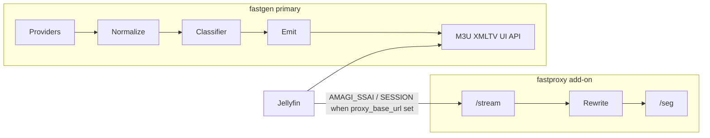
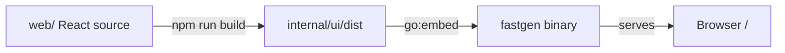

# GoFAST architecture

Self-hosted FAST channel aggregator for Jellyfin: **FASTGen** (primary) produces M3U + XMLTV; **FASTProxy** (optional add-on) rewrites Amagi SSAI “beacon” HLS so ffmpeg/Jellyfin can play it.

Module: [`github.com/j27-aurum/gofast`](https://github.com/j27-aurum/gofast)

Agent workflow: [`AGENTS.md`](../AGENTS.md)  
Product detail / gotchas: [`docs/SPEC.md`](SPEC.md)

## Dual binary, dual image

One Go module, **two** entrypoints and Docker images:

| Binary | Image | Role |
|--------|-------|------|
| `cmd/fastgen` | `fastgen` | Primary: providers, classifier, M3U/XMLTV writers, logos, health, embedded UI |
| `cmd/fastproxy` | `fastproxy` | Add-on: HLS rewrite, beacon resolve, segment shuttle |

Shared logic lives under `internal/` (model, config, httpx, classifier, etc.). There is **no** single binary with `--enable-gen/--enable-proxy` flags.

### Compose topologies

- **Gen-only (default):** `docker compose up` runs `fastgen` on port 8180 with `/data` for config, cache, logos.
- **Gen + proxy:** `docker compose --profile proxy up` also runs `fastproxy` on 8181. Set `proxy_base_url` in gen config to the address **reachable by Jellyfin/ffmpeg** (not merely by gen). Behind TLS, set the same public HTTPS origin on the proxy as `FASTPROXY_PUBLIC_BASE_URL` so rewritten `/s` and `/seg` URIs stay on https. The proxy container sets `FASTPROXY_GEN_URL` (e.g. `http://fastgen:8180`) for origin pull + telemetry push; gen Status (glance) and **Proxy** tab (detail) show proxy activity. Proxy stays headless (no `/data`).

## Data flow



**Classifier dialects** (at refresh): `NATIVE` | `AMAGI_SSAI` | `SESSION` | `XUMO_SSAI` | `DRM`  
(Legacy wire `BEACON` canonicalizes to `AMAGI_SSAI`.) Glossary: [`docs/TERMINOLOGY.md`](TERMINOLOGY.md).

**Emission (in gen):**

- `NATIVE` / `XUMO_SSAI` → upstream URL (unless `proxy_all`)
- `DRM` → always drop
- `AMAGI_SSAI` → `{proxy_base_url}/stream/{provider}/{id}.m3u8` if configured; else drop (UI shows “needs FASTProxy”)
- `SESSION` → same proxy `/stream/...` URL when configured; else drop. FASTProxy mints (DAI POST) then 302s to `stream_manifest` — not Amagi rewrite
- Under `proxy_all`: all exported channels get `/stream/...`; proxy branches by `ProxyKind` (rewrite / mint / plain 302)

## UI feathering

The embedded UI ships early and grows with each milestone (no big-bang UI epic):

| Milestone | UI surface |
|-----------|------------|
| M0 | Shell, nav, empty states |
| M1 | Channel list + classification badges |
| M2 | Export status, filter reasons, provider rollups |
| M3 | Health column, probe history, Test now |
| M4 | Config editor + formal acceptance |
| M5 | Proxy-aware states / passive health views |

Tech: React (Vite) SPA under `web/`. Production build lands in `internal/ui/dist` and is **`go:embed`’d into the fastgen binary**, which serves the static files (SPA fallback for client routes). Node is a **build-time** dependency only. Runtime is one static Go binary — no Node in the container. Proxy has no product UI.



## Build and packaging

**Production images must not recompile.** CI is the build authority; `Dockerfile.prod` only packages artifacts.

| Stage | What runs | Output |
|-------|-----------|--------|
| CI — UI | Node 22, `npm ci && npm run build` in `web/` | `internal/ui/dist` |
| CI — Go | Go 1.26.5, `CGO_ENABLED=0`, linux binaries | `bin/fastgen`, `bin/fastproxy` (UI already inside fastgen) |
| CI — gofmt | `gofmt -l .` must be empty | pass/fail gate |
| CI — test | `go test ./...` (after UI build so embed is present) | pass/fail gate |
| CI — image | `Dockerfile.prod` copies binaries + ca-certs (+ healthcheck wget) into distroless | GHCR `…/fastgen`, `…/fastproxy` (`latest`, `build-N`, `sha-*`) |

Why this works: both artifacts are **standalone** — static Go (`CGO_ENABLED=0`) with the UI baked in, so the image runtime (distroless) does not need a matching glibc/Node toolchain. The only contract is **GOOS/GOARCH** (and any future libc choice): CI must build for the platforms you deploy (today: `linux/amd64` on `ubuntu-latest`; add `arm64` later if a NAS/Pi needs it).

| File | Role |
|------|------|
| `Dockerfile.prod` | **Ship path** — copy CI binaries into distroless; used by CI to push GHCR |
| `Dockerfile` | **Local/dev** — multi-stage Node + Go build from source (`docker compose build`) |
| `docker-compose.yml` | Local/dev (build via `Dockerfile` or pull) |
| `docker-compose.prod.yml` | Homelab/Portainer — **pull GHCR only** (no build) |

CI compile/test use GitHub-hosted Node **22** and Go **1.26.5** (same pins as the local `Dockerfile` image). Compile injects `internal/version` via `-ldflags` (`Build` = Actions run number, `Commit` = short SHA). Production images are packaged only via `Dockerfile.prod` from those CI binaries and tagged `latest` / `build-N` / `sha-*`. Homelab never builds from source for production; it pulls `:latest` or pinned `IMAGE_TAG=build-N` after logging into GHCR. Running identity is on `GET /healthz` and Status → System.

## Config

Follow [12factor.net/config](https://12factor.net/config) (see `AGENTS.md`):

- **Deploy-varying values** → environment. Shared: **`PORT`** (listen) for both gen and proxy. Gen-only: `FASTGEN_BASE_URL`, `FASTGEN_DATA_DIR`, `FASTGEN_PROXY_BASE_URL`, `FASTGEN_PROXY_ALL`, `FASTGEN_CACHE_LOGOS`, `FASTGEN_HEALTH_CONSECUTIVE_FAILURES`. Env always wins.
- **`FASTGEN_BASE_URL` / `base_url`:** public origin for logos and absolute links as seen by Jellyfin/browsers. Include the port unless on 80/443 (`http://host:8180`); omit port behind TLS reverse proxy (`https://gofast.example.com`). No trailing slash. Required when `cache_logos` is enabled.
- **`FASTGEN_CACHE_LOGOS` / `cache_logos`:** when true, download logos to `{data_dir}/cache/{provider}/logos` and rewrite M3U/XMLTV/API logo URLs to `{base_url}/logos/...`. Default false (upstream CDN URLs unchanged). Logos live outside generations so they survive refresh commits; local compose bind-mounts a single writable `./.data:/data` (config + cache + channelattr), matching prod which mounts all of `/data`.
- **`FASTGEN_PROXY_BASE_URL` / `proxy_base_url`:** public FASTProxy origin as reached by Jellyfin/ffmpeg. It is canonicalized without a trailing slash. `FASTGEN_PROXY_ALL` / `proxy_all` defaults false and requires a proxy base URL when enabled.
- **`FASTGEN_PROXY_INTERNAL_URL` / `proxy_internal_url`:** optional gen-only origin for health probes. When set, L1/L2 rewrite `EmittedURL` from the public base to this base (e.g. public `http://localhost:8181` → internal `http://fastproxy:8181`) so Manual L2 works inside Docker. Empty = probe the public URL. Does not change M3U emit.
- **`FASTGEN_HEALTH_CONSECUTIVE_FAILURES` / `health.consecutive_failures`:** N for the health FSM (`down` after N consecutive failures; default 3). Used by health producers only — not by the attr store itself.
- **Health probes (`internal/health`):** Health L1 (default 24h) GETs the first media segment for **NATIVE / XUMO_SSAI** and for **`AMAGI_SSAI` when `EmittedURL` is set** (probe through FASTProxy rewrite — never schedule Amagi upstream beacons). Skip `SESSION` on the schedule (mint would fake a tune). Prefer ranged GET, retry without `Range` on 416; soft-retry timeout/5xx; AES-128 segments accepted. Records `http_status`, `duration_ms`, `final_url`, `bytes_read`, range flags. Concurrent L1 workers + per-host caps. Fleet timing is **last sweep + interval** (persisted in `{data_dir}/channelattr/health_schedule.json`). A separate **retry lane** (~1m wake) re-probes only `degraded`/`down` channels with per-channel `next_retry_at` / `retry_step` on `ChannelHealth` (backoff `15m→30m→1h→2h→6h`, then park until baseline). Health L2 ffprobe is **off by default**; when on, escalate degraded/down/untested always and sample healthy (`l2_healthy_sample`, default 0.1); require a video stream; pass `RequestHeaders`; skip Amagi without `EmittedURL`. Results `EmitCheck` into the channel-attr bus. `exclude_unhealthy` (default false) prunes `HealthDown` from export. Prometheus `gofast_provider_channels_health{status=…}`. `GET /api/health/schedule` exposes last/next L1/L2. The classifier labels stream dialect for export/routing and is independent from health/FSM state; former health L2/L3 names map to Health L1/L2 during the one-release alias period.
- **Passive playback health:** FASTProxy pushes telemetry to `POST /api/proxy/events` (stored in `proxyactivity` for the Status/Proxy UI). Mapped events (`playlist_ok` / `playlist_fail` / `origin_miss` / non-cancel `seg_fail`) call `Emitter.EmitCheck` with `source=playback` and patch the live feed — same FSM as probes, push intake rather than `Source.Check`.
- **ffprobe:** shipped in the **fastgen** image (`debian:bookworm-slim` + ffmpeg); default path `/usr/bin/ffprobe` (`health.ffprobe_path`). fastproxy remains distroless/static.
- **Optional YAML** on the data volume: `/data/config.yaml` for structured, non-secret settings. Provider *implementations* are code (packages under `internal/provider/<id>` exposing `New` + `DefaultSettings`, wired into a `map[id]provider.Reader`); the `providers` block only *overlays settings* for a known provider and cannot add one without shipping Go (unknown ids are ignored/warned). Every provider — LG, MJH providers (Pluto, Samsung, Roku, Plex), and published-pair providers (Xumo, Tubi, TCL, DistroTV, LocalNow) — runs only when its YAML block is present and may be disabled explicitly with `enabled: false`. A generated defaults-only config enables nothing. Runtime data only — ship `config.example.yaml` as a template; never commit a filled production file.
- **Config store + hot reload (`internal/config`):** config is its own persistence pattern — one immutable in-memory snapshot, persisted comment-preserving, reconciled live. `config.Store` owns the lifecycle: `Load()` runs the one true load path (`config.New`: defaults → YAML → env) and swaps an `atomic.Pointer[Config]` snapshot plus a revision (SHA-256 of the file bytes); missing file on first boot → write baked-in `config.defaults()` (env values stay in the environment, not baked in). `Save(rev, ops)` — under a mutex — rejects stale revisions, applies dotted-path ops (`config.ApplyPathOps`: `yaml.Node` surgery preserving comments/order/unknown keys; remove = reset-to-default) to a candidate, validates the candidate through `config.New` on a temp file (the exact boot path), atomically renames with a `.bak`, reloads the snapshot, then kicks the ordered **`Reloader` registry** (`Reload(ctx, cfg) error`: logging slog `LevelVar` → `health.Scheduler` timer/worker re-arm → `refresh.Service` provider reconcile). Each subsystem reconciles however it wants; per-subsystem errors are reported in the PUT response without blocking later entries. Rule: **UI edit = live; file hand-edit = restart** (no file watching). Restart-only keys (`listen`, `data_dir`) have no reloader and no UI control. `config.EnvShadow()` marks env-overridden paths so the API/UI locks them (env always wins). Read-only mounts return a typed `ErrReadOnly`.
- **Provider reconcile (`internal/providerset` + `refresh.Service.Reload`):** `providerset` is the catalog of shipped implementations (id → constructor, package defaults, and which optional settings fields the adapter reads, for the UI's `field_support`). `provider.Registry` is mutable under an RWMutex (`Upsert`/`Remove`); callers re-read `Feeds()` per operation. `refresh.Service` supervises one goroutine per enabled provider and on Reload diffs desired vs running: **disable** cancels the goroutine and drops the feed (aggregate/channel list/health sweeps forget it; `/{id}.m3u`+`/{id}.xml` 404) while cache generations and channel attrs stay on disk; **enable** restores from cached raw instantly (warm) or fetches (cold); **settings change** rebuilds the reader, reapplies from cache, and re-arms the timer on interval change. Emission policy / groups / categories / `cache_logos` / `base_url` slices are compared internally — `ReapplyAll` or a logo warm pass runs only when that slice changed. The logo cache is constructed at boot regardless of the flag and gated on the snapshot's `cache_logos`.
- **`GET/PUT /api/config`:** GET returns the revision, source (path / from-file / writable), a per-field map (`value`, `source: default|file|env`, `editable`, env var, `restart_required`), the provider catalog with effective settings + `field_support`, and the probe schedule; secrets never appear (artwork CA PEMs redacted). PUT takes `{revision, ops}` (same-origin checked, 1 MB cap) through `Store.Save` and returns the new revision + per-subsystem reload report; errors: 400 malformed, 403 read-only/cross-origin, 409 stale revision, 422 invalid candidate or locked (env-shadowed / restart-only) path.
- **Per-channel emit (`providers.<id>.channel_emit`):** map of `ChannelEmit` keyed by normalized id on `ProviderSettings` — customizes emitted name/group/number/logo and export mode. Applied in `refresh` transform/prepare (presentation → groups → pre-export soft-clear → emission policy); marshalers use `DisplayName()` / `EmittedGroup` / `OffsetNumber` / `LogoURL`. Persisted via `PUT /api/channels/{provider}/{id}/emit` as a whole-map `Store.Save` PathOp (normalized ids may contain `.`). Channel detail paints configured `emit` + `emit_defaults` for the Customize checkboxes. Force-include sets `ForceInclude` so `exclude_unhealthy` is skipped; DRM / needs-proxy remain hard blocks. Raw cache and synthetic-number maps are never mutated.
- **Group taxonomy (`internal/groups`, `groups` key):** compiled `Policy` (from `groups.Doc`) resolves each upstream group to an emitted group-title and a disabled flag; `groups.Apply` runs in `refresh.prepare()` after Annotate and before `applyEmissionPolicy`, setting `Channel.EmittedGroup` on survivors and marking disabled-group channels `Excluded` with reason `disabled group "X"` (upstream `Channel.Group` untouched). Emitters use `EmittedGroup` when set, else the legacy `format.FormatGroupTitle`. Per-channel emit `group` wins over taxonomy afterward. `groups` is just another managed config key: `PUT /api/groups` routes through `Store.Save`, whose reload kick has `refresh.Service` recompile the policy and re-parse each provider's cached raw through the pipeline (recomputing exclusions from scratch — not the sticky post-exclusion lineup), then `agg.Notify()`. No restart. `GET /api/groups` returns the saved taxonomy plus a discovered upstream pool (auto-merged when ≥2 providers share an exact string) and a live effective-group preview from last-good `Stats.ByGroup`.
- **Programme category taxonomy (`internal/categories`, `categories` key):** merges-only policy (no disable). `categories.Apply` runs in `refresh.prepare()` and sets `Programme.EmittedCategories` from upstream `Categories` when enabled; XMLTV marshal emits `ExportCategories()` (`EmittedCategories` when set, else `Categories`). Icons stay stripped. `GET/PUT /api/categories` mirrors Groups (discovered pool with `auto_merged` when ≥2 providers share a string, preview of effective buckets / programme counts) via `Store.Save` + Reload deep-equal on `cfg.Categories` → `ReapplyAll`. Guide UI colors blocks from the first exported category (deterministic hash palette).
- **Generated artifacts** live under `{data_dir}/cache/`, owned entirely by `internal/cache` (the only package that touches generation disk). Each provider uses immutable generations selected by an atomic `current` pointer. A generation contains `playlist.m3u`, `guide.xml`, lean `meta.json`, and exact upstream payloads under `raw/` (`schedule.json` for LG; `channels.json.gz` + `guide.xml.gz` for MJH; `playlist.m3u` + `guide.xml[.gz]` for published pairs). `meta.json` retains fetched time and historical synthetic channel-number assignments; classifications and health live in the channel-attr store. Older generations may still carry a `classifications` map — boot seeds missing attr rows from it once, then stops writing the map. `status.json` remains outside the generation. The combined aggregate uses the same generation/`current` model under `aggregate/` (`playlist.m3u` + `epg.xml` as one pair). Legacy root-level aggregate files remain readable until the next rebuild. Emitters are deterministic: channels are globally sorted by positive final number with unnumbered rows last, aggregate ids are provider-namespaced, and XMLTV is re-parsed plus semantically checked before publication. `<lcn>` is an intentional non-DTD compatibility extension; Jellyfin numbering comes from M3U `tvg-chno`. On boot fastgen reparses the selected raw files, restores irreproducible metadata, regenerates outputs under the current emission config, and resumes the refresh interval without a network call. An empty aggregate rebuild (no exportable channels) leaves the prior aggregate generation untouched. Keep the cache on a persistent volume/bind mount. **Cache management:** `GET /api/cache` inventories disk sizes + channelattr row counts; soft purge (`POST …/cache/purge`) never deletes the serving generation; `DELETE /api/logos…` clears logos and re-warms when `cache_logos` is on; orphan sweep removes staging leftovers, gens beyond current+1, stale/out-of-lineup logos, and unconfigured provider dirs. Channelattr is never deleted by these actions.
- **Channel attributes** (`internal/channelattr`): SQLite `{data_dir}/channelattr/attr.db` holds **current + history** labels keyed by `(provider, channel_id, kind)` — `health` and `classification`. Producers `Emit` on a Go channel; one AttrReceiver goroutine is the sole writer (boot may `Handle` once to seed legacy meta classifications before Receive starts). Boot `LoadCurrent` is O(attrs), not O(history). Refresh/restore **Annotate** paints current attrs onto `Channel` before `Feed.Set` (classification only when the in-memory field is empty). Generations are the atomic emit trick for playlist/guide/raw, not the system of record for these labels.
- **Client access log (`internal/clientaccess`):** SQLite `{data_dir}/cache/client_access.db` records each successful (200/304) GET of root emit files for Jellyfin/non-UI clients — not `/api/guide/*`. Rows: file, at, ip, status; 30-day prune (throttled). `GET /api/client-access` returns per-file summary + recent events (optional `file`/`ip`/`status`/`limit`); Status shows the summary, Access UI (`/access`) is the sortable/filterable history table. Each hit is also `slog`'d. Client IP prefers `X-Forwarded-For` / `X-Real-IP`.
- **Health UI/API:** Current health is already on channel list/detail JSON (`Channel.Health`). History is `GET /api/channels/{provider}/{normalizedId}/health/history` (`channel_attr_events` where `kind=health`, newest-first; response includes `success_rate_30d` when any checks fall in the window). On-demand: `POST …/health/probe/l1` (Health L1 segment; `/probe/l2` is a compatibility alias) and `POST …/health/probe` (Health L2 ffprobe even when scheduled L2 is off); both patch that channel’s health on the in-memory `Feed`.
- **Channel programmes:** `GET /api/channels/{provider}/{normalizedId}/programmes` returns in-memory `Lineup.Programmes` for that channel (`Programme.ChannelID` = normalized id), filtered by optional RFC3339 `from`/`to` (default now−1h … now+12h). Channel detail Guide strip shows Now/Next and an expandable vertical list; it does not download provider XMLTV.
- **Host rollup:** `GET /api/channels/hosts` recomputes a reverse-DNS tree (TLD → domain → subdomain…) of live lineup `stream_url` hosts on each request (stream provenance; Hosts UI).
- **Refresh logging:** success and failure slog lines include `duration`; each provider logs next upstream refresh ETA every 5 minutes (`next_refresh_at` / `refresh_in`). Publish success also logs `guide_horizon`, `refresh_interval`, and `effective_interval`.
- **Refresh vs guide horizon:** adapters always ingest the full upstream EPG (no client-side time trim). At schedule start and after each successful refresh, `internal/refresh` clamps the configured interval to ≤ half of the empirical (`GuideEnd−FetchedAt`) or declared (`ExpectedGuideHorizon`) ahead-horizon so LKG cannot age past `guide_end` before the next tick. Clamped values are rounded to the nearest minute. Clamps are exposed on feed stats, `/healthz`, Provider Detail, and Prometheus gauges (`gofast_provider_guide_hours_ahead`, `gofast_provider_refresh_interval_seconds{kind=configured|effective}`).
- **Published-pair validation:** Xumo, Tubi, DistroTV, and LocalNow parse shared EXTINF/XMLTV inputs, sanitize upstream bare ampersands, normalize joins, and log playlist-to-guide ID match rates. Numberless channels receive stable first-seen assignments from each provider's configured synthesis base; removed IDs remain reserved and playlist order never determines identity.
- **LG media URLs:** `mediaStaticUrl` junk query is stripped unless `ads.*` SSAI keys are present (Xumo/CloudFront); those keys are kept and `[IFA]`/`[LMT]`-style macros neutralized so classifier can label `XUMO_SSAI` and origin interpolation works.
- **Precedence:** code defaults → YAML (if present) → **env**.
- **Grow config with features:** add proxy / logo TLS / health keys only in the PRs that implement those features; extend `config.example.yaml` there. No standalone ahead-of-time config-layer issues.

Deps target: **stdlib + `gopkg.in/yaml.v3` + `modernc.org/sqlite`** (channel-attr store; pure Go, distroless-friendly) unless an issue justifies more.

## Milestones

| Milestone | Focus |
|-----------|--------|
| **M0** | Spec, dual cmds, Docker stubs, UI shell, core+provider config |
| **M1** | Model/normalize, providers, classifier, early channel UI |
| **M2** | Refresh/emit, logos (+ TLS config), gen HTTP, export UI, Jellyfin-ready gen image |
| **M3** | Health subsystem (+ health config) + health UI; ffprobe in fastgen image |
| **M4** | Config editor polish + &lt;10s acceptance |
| **M5** | fastproxy binary/image, compose profile, passive telemetry |

Honor milestone order. Critical path to a Jellyfin-usable feed ends at M2 gen HTTP + production compose/README.

**Vertical slice first:** prove one provider end-to-end (LG: registry → fetch → emit → `GET /{id}.m3u|.xml`) before adding more adapters (mjh / published-pair). Do not stack all adapters ahead of a callable playlist.

## Package layout (target)

```
cmd/fastgen/
cmd/fastproxy/
internal/
  config/ model/ httpx/
  provider/   # lg; shared mjh wrappers; shared published-pair wrappers
  m3u/ xmltv/ # external-format parsers and writers
  classifier/
  channelattr/ # current+history channel labels (health; classification next)
  health/     # EmitCheck, Health L1 segment / Health L2 ffprobe, scheduler
  logocache/ refresh/
  proxy/         # FASTProxy rewrite, sessions, seg shuttle, reporter
  proxyactivity/ # gen-side SQLite glass for proxy events/snapshots (Proxy UI tab)
  server/ ui/   # ui embeds Vite dist from web/
web/            # React + Vite source (build → internal/ui/dist)
testdata/
config.example.yaml
Dockerfile.prod     # production: package CI-built binaries only (no Node/Go rebuild)
Dockerfile          # optional local multi-stage build from source
docker-compose.yml
docker-compose.prod.yml
stack.env
.github/workflows/  # UI build → go build → test → Dockerfile.prod → GHCR
```

Homelab pull requires `docker login ghcr.io` while the repo/packages are private.

## Operational notes

- Outbound calls: timeouts (default 60s), retry with backoff; stream probes use GET (prefer Range, never HEAD; plain GET on 416).
- Last-known-good cache under `/data/cache/`; when `cache_logos` is on, durable logos under `/data/cache/{provider}/logos/` (served at `GET /logos/{provider}/{file}`).
- Artwork-only TLS exceptions (extra CA / insecure skip) must never apply to stream or EPG clients.
- `proxy_all` (default off): all exported URLs go through proxy; NATIVE gets 302 upstream. Makes proxy availability-critical for all channels.
